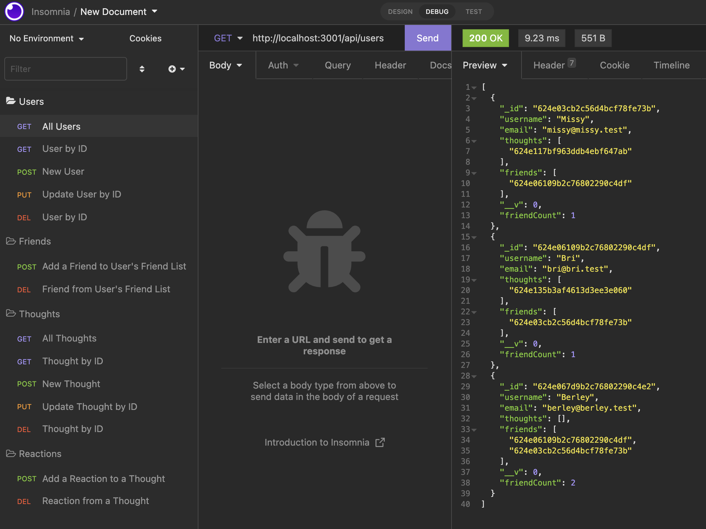
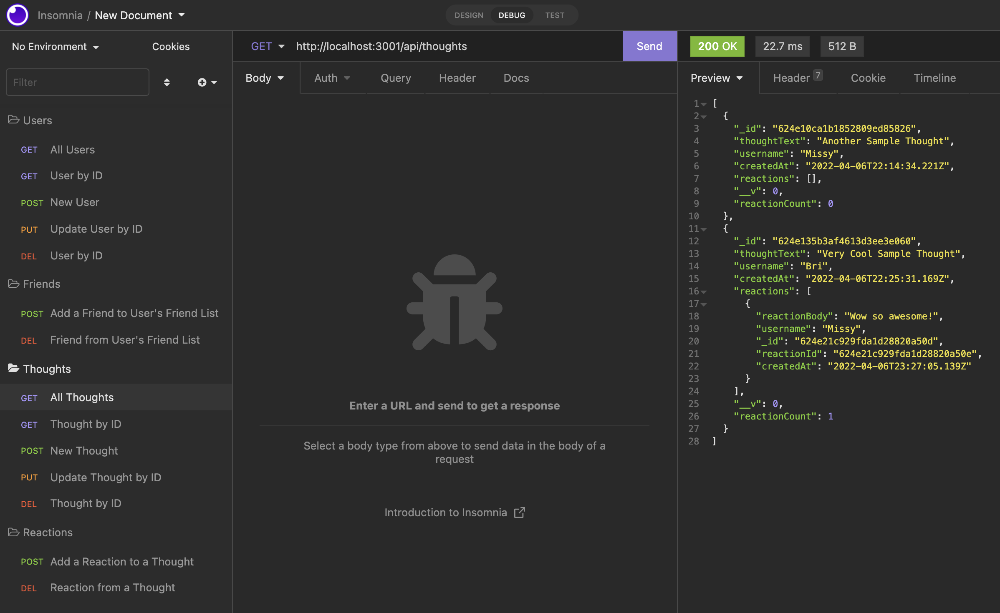

# Social Network API

## Table of Contents:

- [Description](#description)
- [Usage](#usage)
- [Installation](#installation)
- [GitHub Repo](#github-repo)
- [Video Walkthrough](#video-walkthrough)
- [Screenshots](#screenshots)
- [Questions](#questions)

## Description

This project serves as an application program interface for a social networking app. Just add front end code, and your new social network is ready to be launched!

## Usage

Build a new social network with the help of this API. This API consists of several routes that allow you to:

- `POST` new users, friends to a user's friend list, thoughts from any user, or reactions to any thoughts.
- `GET` all users, all thoughts, a single user by ID, or a single thought by ID.
- `PUT` (update) a user or a thought.
- `DELETE` a user, a friend from a user's friend list, a thought, or a reaction to a thought.

## Installation

First, clone down the code repository from GitHub. Then, run `npm i` in your terminal to install the necessary node modules. Next, run `node index.js` to begin the server. Once the server is live, you can begin testing the routes for yourself!

## GitHub Repo

https://github.com/mfandel118/Social-Network-API

## Video Walkthrough

https://drive.google.com/file/d/1ggq79FcQClihlFX_kINkeHgWtLNoov2U/view

## Screenshots

## Questions

Any additional questions about this project? Please feel free to reach out:

Marissa Fandel

- Email: mfandel118@gmail.com
- GitHub: https://github.com/mfandel118
